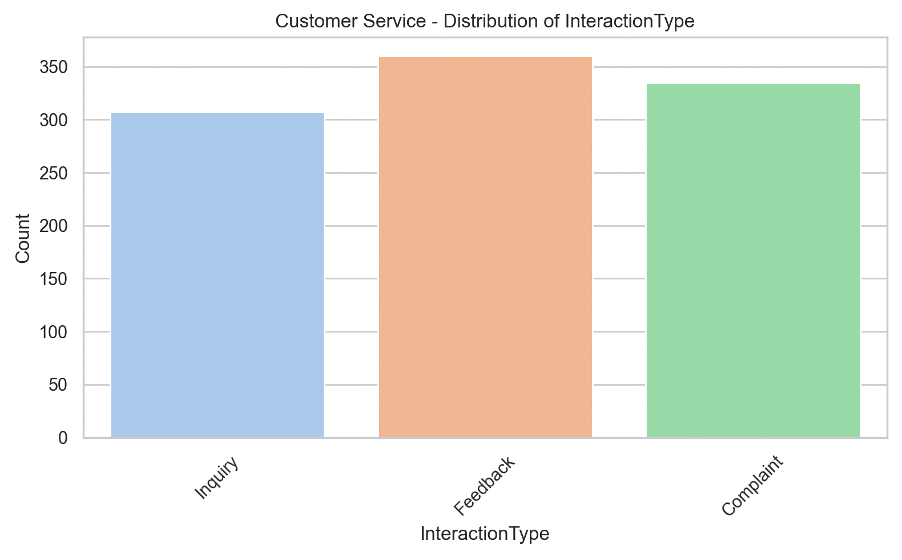
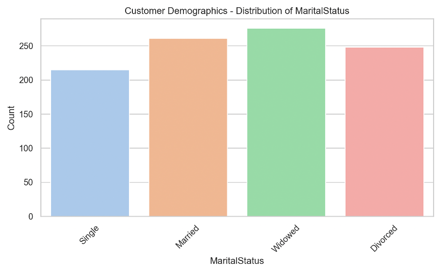
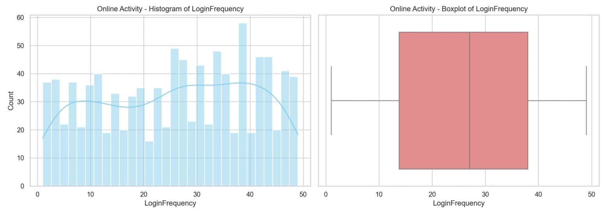

# 🧠 Customer Churn Predictor
This project presents a complete machine learning pipeline for predicting customer churn in a banking environment. Using behavioral and demographic data from multiple sources, the goal is to help financial institutions proactively identify customers at high risk of churning. Through data exploration, preprocessing, and model development, this solution enables targeted retention strategies to improve customer loyalty.

## 📌 Problem Statement
Customer churn is a major challenge in the financial services industry. Retaining existing customers is significantly more cost-effective than acquiring new ones. By identifying early signals of potential churn, businesses can proactively engage at-risk customers and improve long-term loyalty.

This project aims to:

- Integrate behavioral signals from **Demographics**, **Transaction History**, **Customer Service Interactions**, **Online Behaviour**, and **Churn Status**
- Engineer meaningful, customer-level features that capture churn-related patterns
- Build and evaluate a high-performing machine learning model to predict churn risk
- Translate predictive insights into actionable recommendations for customer retention strategies

## 🧩 Data Sources & Structure
The dataset is provided as an Excel file containing multiple sheets, each capturing a different aspect of customer behavior:

- **Sheet 0 – Demographics**: Includes customer attributes such as age, gender, income, and location.
- **Sheet 1 – Transaction History**: Records transactional data including dates, amounts, and product types.
- **Sheet 2 – Customer Service Interactions**: Logs interaction types, timestamps, and resolution statuses.
- **Sheet 3 – Online Behavior**: Tracks login frequency, last login date, and usage of online services.
- **Sheet 4 – Churn Status**: Contains the target variable indicating whether a customer has churned.

These sheets were merged on the common `CustomerID` field to form a unified, customer-level dataset suitable for analysis and modelling.

## 📈 Exploratory Data Analysis (EDA)
Exploratory Data Analysis (EDA) was conducted to uncover key trends, patterns, and relationships within the data. This step helped guide feature engineering and informed modelling decisions by identifying variables with strong potential to influence customer churn.

The following is an example of visualizations generated to support this analysis:

## 🧹 Data Cleaning and Preprocessing
- **Data Merging**: Combined multiple data sources into a single, unified customer profile using `CustomerID` as the key.
- **Feature Aggregation**: Applied aggregation to generate customer-level statistics from transactional and interaction data.
- **Feature Selection**: Removed high-cardinality and redundant features to reduce noise and dimensionality.
- **Categorical Encoding**: Transformed categorical variables into numerical format using one-hot encoding.
- **Normalization**: Scaled numeric features to a 0–1 range using `MinMaxScaler` to ensure consistent input for model training.

## 🤖 Model Building
- **Model Used**: XGBoost Classifier – selected for its robustness, handling of imbalanced data, and strong predictive performance.
- **Key Hyperparameters**:
  - `scale_pos_weight=12`: To address the class imbalance in churn labels.
  - `max_depth=5`, `learning_rate=0.05`, `n_estimators=200`: Tuned for balanced bias-variance tradeoff.
- **Training Strategy**:
  - Used an 80/20 train-test split with stratification to preserve class distribution.
  - Applied 5-fold Stratified Cross-Validation to validate model generalization and reduce overfitting.

## 📊 **Model Evaluation**
The model was evaluated using a combination of threshold analysis and standard classification metrics to ensure robust performance, particularly given the class imbalance in the churn data.

**Key Evaluation Steps:**
- **Precision–Recall Curve Analysis**: Used to assess model performance under different threshold settings, with a focus on improving recall.
- **Threshold Tuning**: The classification threshold was adjusted to **0.12** to increase sensitivity to churn cases, based on PR curve insights.

**Reported Metrics:**
- **Classification Report**: Includes Precision, Recall, and F1-Score for both classes.
- **Confusion Matrix**: Highlights true positives, false positives, false negatives, and true negatives.
- **ROC-AUC Score**: Measures the model’s ability to distinguish between churn and non-churn classes.
- **Mean Cross-Validated F1 Score**: Average F1 score across 5-fold stratified cross-validation to evaluate generalization.

## 📌 Recommendations
- **Proactive Customer Engagement**: Prioritize outreach to customers flagged by the model, especially those with low digital interaction frequency or unresolved service issues. These are strong signals of potential churn.
- **Incentive-Driven Retention**: Use model predictions to guide targeted retention campaigns. Offering personalized incentives—such as cashback, loyalty points, or exclusive offers—can improve customer satisfaction and reduce churn risk.
- **Model Maintenance & Monitoring**: Continuously retrain and evaluate the model with fresh data to maintain accuracy over time. As customer behavior evolves, regular updates will help ensure the model remains relevant and reliable.

